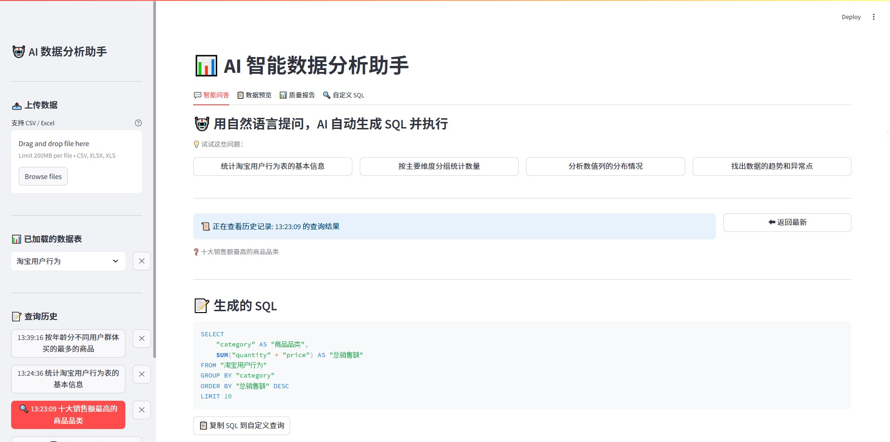
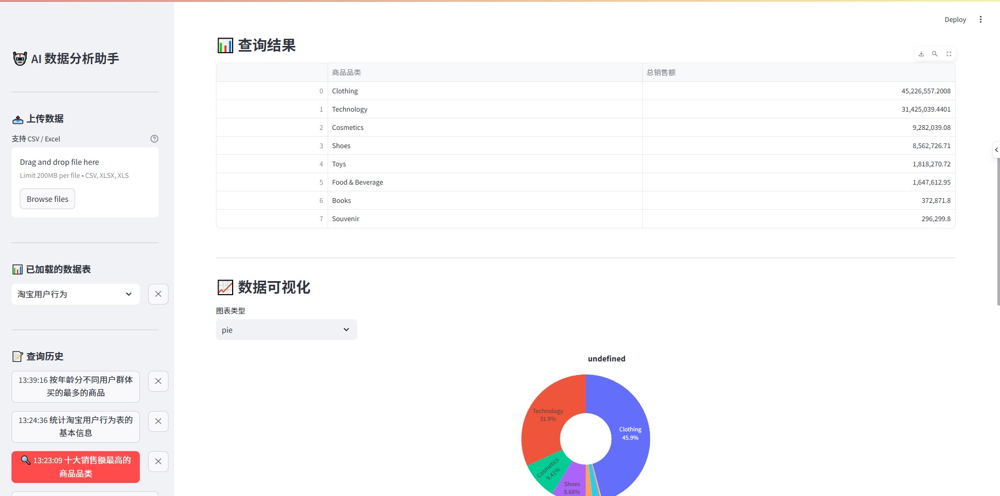
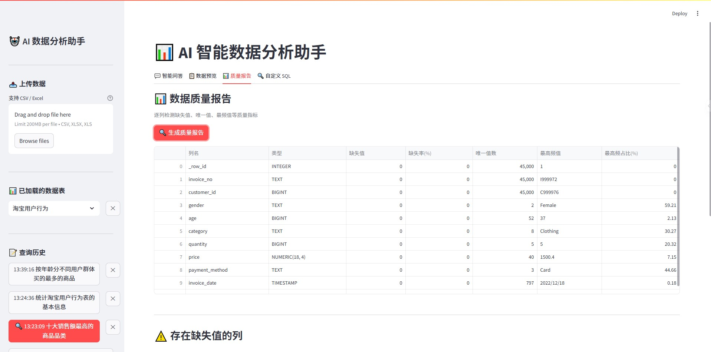
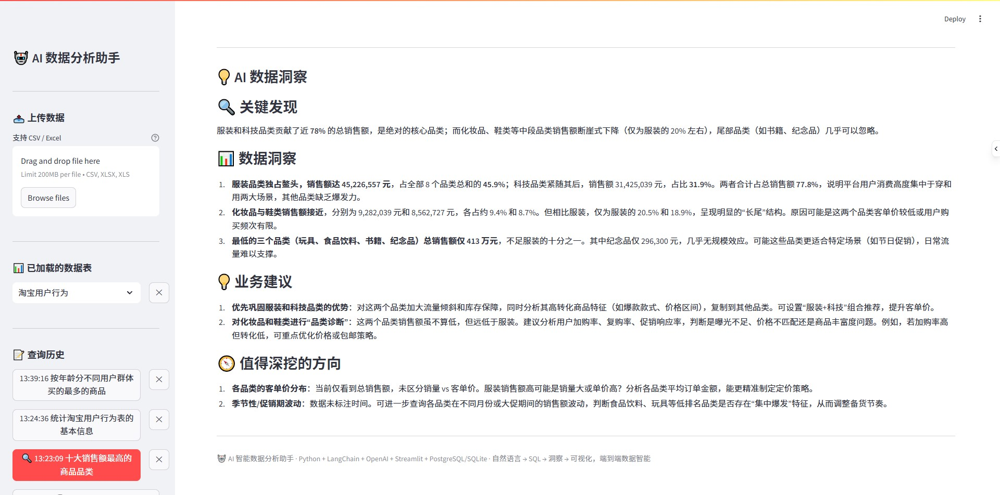
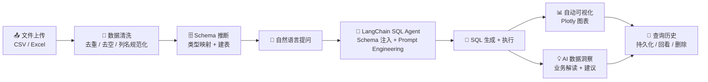

# 🤖 AI 智能数据分析助手

> 自然语言 → SQL → 洞察 → 可视化，端到端数据智能

[](https://www.python.org/)
[](https://streamlit.io/)
[](https://www.langchain.com/)
[](LICENSE)

上传 CSV/Excel 文件，用**自然语言**提问，AI 自动生成 SQL、执行查询、绘制图表、输出业务洞察。

---

## 📸 功能预览

### 智能问答 —— 自然语言 → SQL → 表格 + 图表 + 洞察



### 数据可视化 —— Plotly 交互式图表，自动推荐类型



### 质量报告 —— 逐列缺失率、唯一值、高频值分析



### AI 数据洞察 —— 基于实际数据生成业务分析报告



---

## 🏗️ 项目架构



```
src/
├── config.py              # 全局配置（环境变量读取）
├── data_loader/
│   ├── loader.py          # 文件加载（多编码自动检测）
│   └── cleaner.py         # DataFrame 清洗
├── database/
│   ├── connection.py      # SQLAlchemy 连接管理（SQLite / PostgreSQL）
│   └── schema.py          # Schema 推断 + 高性能批量入库 + 质量报告
├── agent/
│   └── sql_agent.py       # LangChain SQL Agent（核心：NL → SQL）
├── insights/
│   └── generator.py       # AI 洞察生成（基于原始数据，非 LLM 转述）
└── visualization/
    └── charts.py          # Plotly 图表 + 自动类型推荐
```

---

## 🚀 快速开始

### 方式一：Docker 一键部署（推荐 ⭐）

> 无需安装 Python，只需 Docker。适合快速体验。

```bash
# 1. 克隆项目
git clone https://github.com/rzbbbbbbbb/ai-data-analyst.git
cd ai-data-analyst

# 2. 配置 API Key
cp .env.example .env
# 编辑 .env，填入你的 OPENAI_API_KEY

# 3. 一键启动
docker-compose up -d

# 4. 浏览器打开
# http://localhost:8501
```

**停止服务：** `docker-compose down`

> 💡 数据库和查询历史保存在 `./data` 目录，容器删除后数据不丢失。

---

### 方式二：手动安装

```bash
# 1. 克隆
git clone https://github.com/rzbbbbbbbb/ai-data-analyst.git
cd ai-data-analyst

# 2. 安装依赖（需 Python 3.9+）
pip install -r requirements.txt

# 3. 配置 API Key
cp .env.example .env
```

编辑 `.env`，填入你的 API 信息：

```env
DATABASE_URL=sqlite:///./data/analyst.db
OPENAI_API_KEY=sk-your-key-here
OPENAI_BASE_URL=https://api.openai.com/v1
LLM_MODEL=gpt-4o-mini
```

> 💡 兼容所有 OpenAI 格式的 API，包括 DeepSeek、通义千问、智谱 GLM 等。

```bash
# 4. 启动
streamlit run streamlit_app.py
```

浏览器打开 **http://localhost:8501**，上传数据即可开始提问。

---

## 🐳 Docker 部署详解

### 前置要求
- 安装 [Docker Desktop](https://www.docker.com/products/docker-desktop/)（Windows/Mac）或 Docker Engine（Linux）

### 部署步骤

```bash
# 1. 克隆项目
git clone https://github.com/rzbbbbbbbb/ai-data-analyst.git
cd ai-data-analyst

# 2. 配置 API Key（从 .env.example 复制模板）
cp .env.example .env
# 用文本编辑器打开 .env，填入：
#   OPENAI_API_KEY=你的密钥
#   OPENAI_BASE_URL=你的API地址
#   LLM_MODEL=模型名称

# 3. 构建并启动
docker-compose up -d

# 4. 查看日志（确认启动成功）
docker-compose logs -f
```

浏览器打开 **http://localhost:8501**。

### 常用命令

| 命令 | 作用 |
|:---|:---|
| `docker-compose up -d` | 后台启动 |
| `docker-compose down` | 停止并删除容器 |
| `docker-compose logs -f` | 查看实时日志 |
| `docker-compose restart` | 重启服务 |
| `docker-compose ps` | 查看运行状态 |

### 文件说明

| 文件 | 作用 |
|:---|:---|
| `Dockerfile` | 镜像构建定义（Python 3.11 + 依赖） |
| `docker-compose.yml` | 编排配置（端口 8501 + 数据持久化） |
| `.env` | API 密钥配置（不入 git，需自行创建） |

---

## 💡 核心能力

### 智能 SQL 生成
- **Schema 注入**：建表时自动提取列名、类型、统计值、样本行，全部注入 System Prompt
- **Few-shot 示例**：Prompt 内置环比增长率、Top-N 排名、分层分析等 SQL 模板
- **CTE + 窗口函数**：LLM 会生成 `WITH ... ROW_NUMBER() OVER(...)` 等高级 SQL
- **安全约束**：仅允许 SELECT，自动拦截 DROP/DELETE/UPDATE 等危险操作

### AI 数据洞察
- **直接分析原始数据**：不依赖 Agent 文字转述，计算精确的总和/均值/分布
- **结构化输出**：关键发现 → 数据洞察 → 业务建议 → 深挖方向
- **反幻觉**：温度 0.3 + 明确指令"严禁编造数据"

### 高性能数据加载
- 原始 `executemany` + SQLite PRAGMA 优化 → 10 万行数据 **~20 秒**入库
- 多编码自动检测（UTF-8 / GBK / GB2312 / Latin1）

### 查询历史持久化
- JSON 文件存储，服务器重启不丢失
- 点击回看历史结果，一键删除

---

## 🔧 技术栈

| 层次 | 技术 | 用途 |
|:---|:---|:---|
| 前端 | Streamlit 1.38 | Web UI |
| Agent 框架 | LangChain 0.3 | SQL Agent + Prompt 编排 |
| LLM | OpenAI 兼容 API | 自然语言 → SQL（支持 DeepSeek / GPT / GLM） |
| 数据库 | SQLAlchemy 2.0 + SQLite | 数据存储 + SQL 执行 |
| 可视化 | Plotly 5.24 | 交互式图表 |
| 数据处理 | Pandas 2.2 | 文件加载 + 数据清洗 |

---

## 🧪 运行测试

```bash
pytest tests/ -v
```

---

## 📝 示例问题

上传销售数据后，试试这些问题：

- 「上个月各品类的销售额排名和环比增长率」
- 「按区域分析客单价分布，找出高价值区域」
- 「各品类的月度销量趋势，用 CTE + 窗口函数」
- 「分析复购率最高的前 10 个用户」

---

## 📄 License

MIT © 2025
